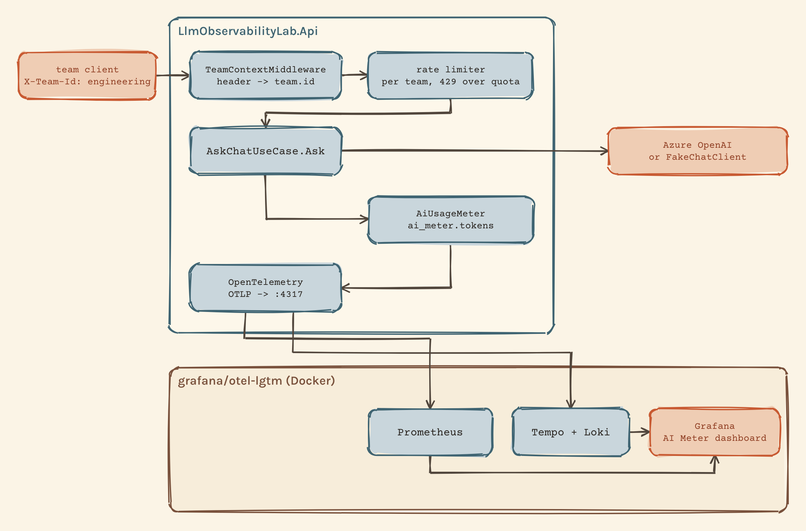

# AI Meter

Put a language model behind an API and, within a week, someone will ask which team is spending the money. This lab shows one way to answer that with ASP.NET Core, OpenTelemetry and Grafana: usage and estimated cost per team and per model, plus a quota that stops one team from using everyone's budget.

Use it as a template. Each piece is small, and the steps below follow the order you would add them to your own API.

## What you get

With two teams sending traffic, the Grafana dashboard shows:

- Estimated cost per team, from tokens times the model's reference price.
- Accumulated tokens per team, split by input and output and by model.
- Tokens per minute by team and type.
- Rejected calls (4xx and 5xx) per team, with a separate panel for calls blocked by the quota (429).
- p95 latency of `/api/chat` per team.

The model is the dependency being observed. The team is the thing being measured.

## How it fits together



The caller sends `POST /api/chat` with an `X-Team-Id` header. A middleware validates the team and tags the trace, the log scope and the ASP.NET request metric with it. The rate limiter keeps one window per team and answers 429 above the quota. The use case calls the model through `IChatClient` and records the returned token usage in a counter tagged with team and model. OpenTelemetry exports everything over OTLP to the `grafana/otel-lgtm` container, and the dashboard in `grafana/dashboards/ai-meter.json` reads Prometheus.

## Step 1: identify the team on every call

Everything downstream depends on knowing who is calling. `TeamContextMiddleware` reads the header once, rejects unknown teams before any work happens, and copies the team to the three signals:

```csharp
if (TryReadTeam(context.Request, out string teamId) is false)
{
    await RejectAsync(context);
    return;
}

_teamContext.TeamId = teamId;
Activity.Current?.SetTag(TeamContext.PropertyName, teamId);
context.Features.Get<IHttpMetricsTagsFeature>()?.Tags.Add(
    new KeyValuePair<string, object?>(TeamContext.PropertyName, teamId));
```

`TeamContext` is a scoped object, so the controller and the rate limiter read the same team for the rest of the request. The `IHttpMetricsTagsFeature` line is what makes latency and failures per team possible without a second histogram: ASP.NET already measures every request, and this adds `team.id` to that measurement.

In this lab the team is a header value. In your API it has to come from the caller's identity, otherwise anyone can pick another team's quota by editing a header.

## Step 2: count tokens per team and model

`AiUsageMeter` owns one counter, `ai_meter.tokens`, created through `IMeterFactory`. After each model call, the use case records what the model reported:

```csharp
_usageMeter.RecordTokens(
    teamId,
    chatResponse.ModelId,
    chatResponse.Usage?.InputTokenCount ?? 0,
    chatResponse.Usage?.OutputTokenCount ?? 0);
```

Each measurement carries three tags: `team.id`, `token.type` (`input` or `output`) and `gen_ai.request.model`. The model tag matters for cost, because prices differ per model and per direction. `ModelId` comes from the response, so it carries the exact model version the provider served.

## Step 3: export to Grafana

`TelemetryRegistration` enables ASP.NET Core and HttpClient instrumentation, listens to the `Experimental.Microsoft.Extensions.AI` source and meter, adds the `AiMeter` meter, and sends traces, metrics and logs through one OTLP exporter. Start the backend:

```bash
docker run -d --name lgtm -p 3000:3000 -p 4317:4317 grafana/otel-lgtm
```

Open [Grafana](http://localhost:3000), sign in with `admin` / `admin`, go to Dashboards, New, Import, and upload `grafana/dashboards/ai-meter.json`. In Prometheus the counter appears as `ai_meter_tokens_total` with labels `team_id`, `token_type` and `gen_ai_request_model`.

## Step 4: turn tokens into money

Cost is a query, not a metric. The dashboard multiplies tokens by the reference price for gpt-4.1-mini (0.40 USD per million input tokens and 1.60 USD per million output tokens, September 2026):

```promql
sum by (team_id) (last_over_time(ai_meter_tokens_total{token_type="input"}[$__range])) * 0.40 / 1e6
+ sum by (team_id) (last_over_time(ai_meter_tokens_total{token_type="output"}[$__range])) * 1.60 / 1e6
```

Keeping the price in the query means changing it needs no deploy, and the panel says what it is: an estimate, not the Azure invoice. One detail to get right: the cumulative panels use `last_over_time`, which reads the latest sample in the selected range, so they mean "since the API started". `increase()` measures growth between samples, and a short run whose first sample already contains all the calls shows zero. With continuous traffic `increase()` is the right choice, and the tokens-per-minute panel uses `rate()` for that reason.

## Step 5: cap each team

ASP.NET Core's built-in rate limiter can partition by any key. Here the key is the team resolved in step 1:

```csharp
options.AddPolicy(PolicyName, httpContext =>
{
    string teamId = httpContext.RequestServices.GetRequiredService<TeamContext>().TeamId;

    return RateLimitPartition.GetFixedWindowLimiter(teamId, _ => new FixedWindowRateLimiterOptions
    {
        PermitLimit = requestsPerMinute,
        Window = TimeSpan.FromMinutes(1),
        QueueLimit = 0,
    });
});
```

`ChatController` opts in with `[EnableRateLimiting("per-team")]`, so other endpoints stay unlimited. The quota comes from `Teams:RequestsPerMinute` (60 by default). A rejected call gets 429, a `Retry-After` header and the same error body the API uses everywhere. Because the request metric already carries the team, the 429s show up per team in Grafana with no extra code.

## Step 6: run it

You need the .NET 10 SDK and Docker. Start with the fake model, which answers instantly with invented token counts and never calls Azure:

```bash
AzureOpenAI__UseFakeClient=true Teams__RequestsPerMinute=100 dotnet run --project src/LlmObservabilityLab.Api
```

Send a request, then repeat it with `X-Team-Id: support`:

```bash
curl -s -X POST http://localhost:5286/api/chat \
  -H 'Content-Type: application/json' -H 'X-Team-Id: engineering' \
  -d '{"prompt":"What is a token?"}'
```

To see the quota, send more calls than the limit allows inside one minute and count the status codes:

```bash
for i in $(seq 1 150); do
  curl -s -o /dev/null -X POST http://localhost:5286/api/chat \
    -H 'Content-Type: application/json' -H 'X-Team-Id: engineering' \
    -d '{"prompt":"Summarise this."}' -w '%{http_code}\n'
done | sort | uniq -c
```

Expect 100 lines of `200` and 50 of `429`, provided the loop finishes inside one 60-second window. A call from `support` still returns 200. The dashboard picks the numbers up on the next metrics export, about a minute later.

To run against a real deployment, `az login` and pass your resource and deployment name:

```bash
AzureOpenAI__Endpoint='https://<resource>.openai.azure.com/' AzureOpenAI__DeploymentName=gpt-4.1-mini dotnet run --project src/LlmObservabilityLab.Api
```

`dotnet test` runs the 28 tests, including the ones that prove one team's quota does not touch the other's.

## Where this example stops

- The team is a header. Production needs it from authentication.
- The quota counts requests. Azure bills tokens, and a request limiter decides before the model reports usage, so a token budget needs a limiter of its own.
- Prices live in the dashboard JSON. Configuration with a date is easier to audit.
- Errors go through an MVC exception filter. `IExceptionHandler` with ProblemDetails is the current ASP.NET Core recommendation.
- The backend is a local container. Azure Monitor is the next stop for the same signals.

## Troubleshooting

After the Mac sleeps, the Docker VM's clock lags and Prometheus stamps samples hours in the past, so the dashboard looks empty. Widen the time range to find them, and check `docker exec lgtm date` before a demo.

Grafana's metrics explorer does not list metrics that arrive over OTLP, because they carry no metadata. Type the metric name in Code mode.

The first real call can spend seconds on local authentication. `DefaultAzureCredential` probes Managed Identity on a laptop, so the API excludes that credential in Development.
