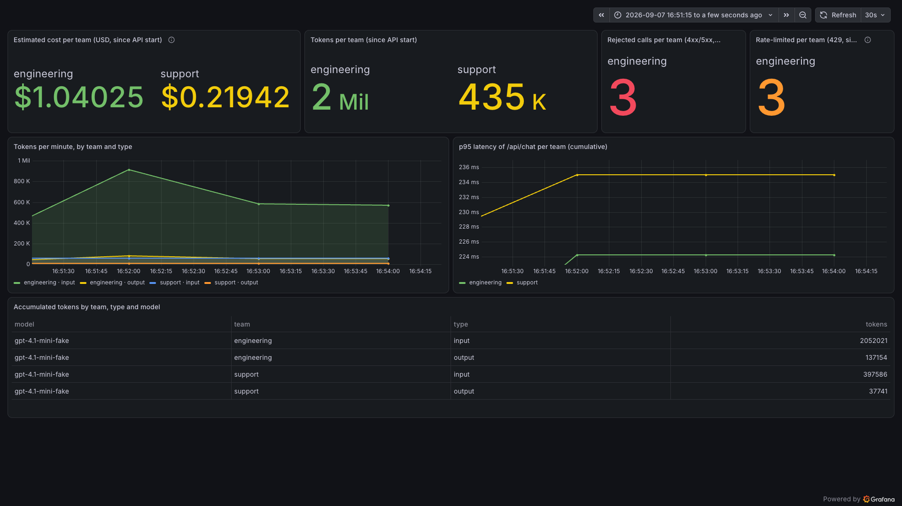

# AI Meter

AI Meter is an ASP.NET Core lab for tracking LLM token usage, estimated cost, failures and latency per team with OpenTelemetry and Grafana. Each team has its own request limit.

Read the accompanying blog post: [AI Meter: run a lab for LLM usage, estimated cost and team limits](https://danieldias.dev/en/blog/ai-meter-usage-and-cost-per-team).



This earlier capture uses simulated data. Its totals differ from the repeatable demo below and represent no actual spending.

## Run the lab

You need the .NET SDK selected by [global.json](global.json) and Docker. Run the commands below from the repository root.

### 1. Start Grafana and the API

```bash
docker run -d --name lgtm -p 3000:3000 -p 4317:4317 grafana/otel-lgtm
AzureOpenAI__UseFakeClient=true Teams__RequestsPerMinute=2 \
  dotnet run --project src/LlmObservabilityLab.Api --launch-profile http
```

If the `lgtm` container already exists, use `docker start lgtm`. The `http` profile selects Development, listens on `http://localhost:5286` and exports OTLP to `http://localhost:4317`.

The fake client reports 100,000 input tokens and 10,000 output tokens on every successful call, with a fixed simulated delay of 100 ms. It returns `Fake answer for the AI Meter lab.` as model `gpt-4.1-mini-fake`. It makes no Azure calls and is available only in Development. HTTP latency also includes application overhead.

Open [Grafana](http://localhost:3000), sign in with `admin` / `admin`, go to Dashboards, New, Import, and upload [grafana/dashboards/ai-meter.json](grafana/dashboards/ai-meter.json).

### 2. Prove that each team has its own quota

In another terminal, send three requests within one minute:

```bash
for i in 1 2 3; do
  curl -s -o /dev/null -X POST http://localhost:5286/api/chat \
    -H 'Content-Type: application/json' -H 'X-Team-Id: engineering' \
    -d '{"prompt":"What is a token?"}' -w '%{http_code}\n'
done
```

With a freshly started API, expect `200`, `200`, then `429`. Now send a request from support:

```bash
curl -i -X POST http://localhost:5286/api/chat \
  -H 'Content-Type: application/json' -H 'X-Team-Id: support' \
  -d '{"prompt":"What is a token?"}'
```

Expect HTTP 200 and `{"text":"Fake answer for the AI Meter lab."}`. Engineering has used its allowance, but support has its own window. Another engineering request within that window returns 429 with `Retry-After` and an `errors` array. Restart the API before repeating the whole sequence to clear both allowances.

After the next metrics export, normally about a minute later, Grafana should show tokens for both teams and one blocked engineering call. The p95 panel and tokens-per-minute panel need multiple samples, so keep sending traffic over several minutes to inspect them.

These requests produce the following simulated usage, assuming a fresh API and no other traffic:

| Team | Successful calls | Blocked calls | Input tokens | Output tokens | Estimated cost (USD) |
|---|---:|---:|---:|---:|---:|
| engineering | 2 | 1 | 200,000 | 20,000 | 0.112 |
| support | 1 | 0 | 100,000 | 10,000 | 0.056 |

The cost uses the dashboard's configured reference rates: 0.40 USD per million input tokens and 1.60 USD per million output tokens. These simulated values do not represent a bill. Prices apply to all models in the current query, so update the query before using another model.

To connect Azure OpenAI, follow [the real-model setup](docs/lab-guide.md#connect-a-real-model). The [lab guide](docs/lab-guide.md) also explains telemetry, cost queries and troubleshooting.

## Code conventions

The API uses MVC controllers with dependencies injected into each action, and one use case per operation. The chat operation exposes `IAskChatUseCase.Ask`. Validation runs inside the use case and HTTP 400 errors share `ErrorResponse`.

Keep explicit constructors, sealed concrete classes and namespaces matching folders. Tests use `Should...When...` names, FluentAssertions and Moq behind builders, in separate projects for use cases, validators and HTTP behaviour. The [convention details](docs/lab-guide.md#code-conventions) explain the boundaries.

## Verify a change

```bash
bash scripts/verify.sh
```

The script restores packages, builds, runs tests, checks formatting and reports vulnerable packages. Tests run locally without Azure calls. Shared build settings are in `Directory.Build.props`, package versions in `Directory.Packages.props`, and formatting rules in `.editorconfig`.

## Lab boundaries

Teams come from an `X-Team-Id` header; a deployed app needs identity from authentication. The quota counts requests and lives in memory per API instance. Restarting clears it. Development captures prompts and responses, so use synthetic prompts. See [the lab guide](docs/lab-guide.md#where-this-example-stops) for the remaining limitations.
